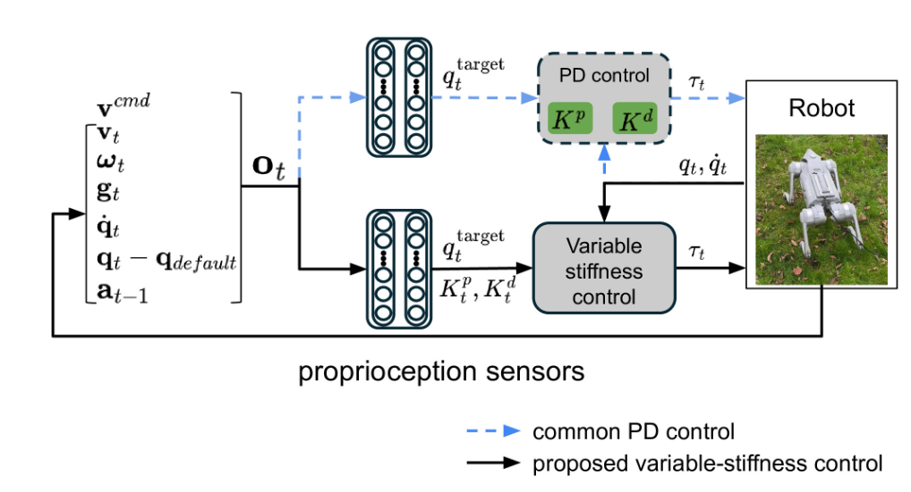
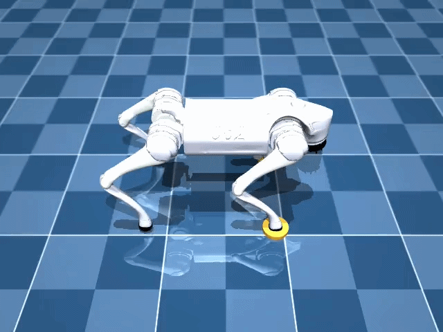
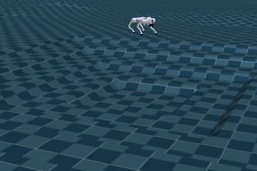
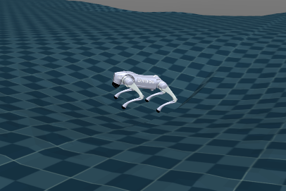
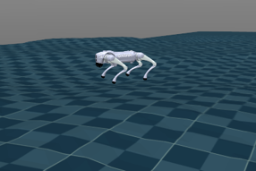
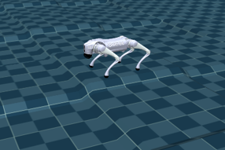

# Variable Stiffness Locomotion (varstif_locomotion)
This repository provides the module for training and testing policies presented in this [paper](https://arxiv.org/abs/2502.09436), which was published at the IFAC conference July,2025. 
Rather than being a standalone ML experiment, Varstif Locomotion is intended as the policy learning module of a larger robotics system, separating training, evaluation, and [deployment](https://github.com/DarioRepoRuler/unitree_mujoco/tree/main) into modular components. 
For deeper insights you can also read into my [Master thesis](https://dario-spoljaric.com/assets/download/Masterarbeit.pdf). 



The reinforcement learning technique used is **PPO (Proximal Policy Optimization)**. The simulation enviroment used is Mujoco-MJX. 

## The Problem: Manual Gain Tuning
Traditional RL locomotion often requires tedious manual tuning of joint stiffness (Kp​) and damping (Kd​) to match specific robot morphologies. This project introduces a novel control paradigm that integrates dynamic stiffness into the action space.
By allowing the policy to modulate its own mechanical impedance, we enable: grouped stiffness control such as per-joint stiffness (PJS), per-leg stiffness (PLS) and hybrid joint-leg stiffness (HJLS). 
We show that variable stiffness policies, with grouping in per-leg stiffness(PLS), outperform position-based control in velocity tracking and push recovery. 

Different control architectures are implemented to offer a fair comparison to the SOTA:
- Position-based control (shown as blue dashed feedback loop)
- Torque-based control
- Position + stiffness (and damping) control (shown as black feedback loop)

## System Context

Varstiff Locomotion is not an isolated training pipeline. It is part of a modular robotics system:

```
┌──────────────────────────────┐
│   Policy Learning (Varstiff )│
│   - RL training              │
│   - Evaluation               │
│   - Policy export            │
└────────────┬─────────────────┘
             │ exported policy
             ▼
┌──────────────────────────────┐
│  Deployment Layer (ROS2)     │
│  - Real robot execution      │
│  - Sensor integration        │
│  - Control interface         │
└──────────────────────────────┘
```
[This](https://github.com/DarioRepoRuler/varstif_locomotion) repository focuses exclusively on the policy learning and validation stage. The ROS2 implementation for deploying policies on the real robot can be found in my [Unitree Mujoco Repo](https://github.com/DarioRepoRuler/unitree_mujoco/tree/main).  

## Requirements
For the efficient execution of this repo, a GPU is strongly recommended. All of this code was executed under: `Ubuntu 22.0.4` with a GPU: ` NVIDIA GeForce GTX 1060 6GB`. 
Under normal settings such as 4096 parallelised environments with flat floor training required about 3GB of VRAM. 


## Installation 
```
git clone git@github.com:DarioRepoRuler/varstif_locomotion.git
conda create -n varstif python=3.12
conda activate varstif
cd varstif_locomotion
pip install -r requirements.txt
```

## Training
Per default brax is allocating 75 % of the GPU memory. This might not be necessary and therefore this parameter can be passed as "XLA_PYTHON_CLIENT_MEM_FRACTION".
Training can be executed with this line of code:
```
XLA_PYTHON_CLIENT_MEM_FRACTION=.1 python train.py
```
The training settings can be investigated in the folder `config/`. This folder holds two configuration files. `train.yaml`holds the settings for Training and `test.yaml` the settings inherited by the test script. The overall policy settings are shared in `config/policy/`.

|  |  |  |
|:--------------------------------------:|:------------------------------------------:|:------------------------------------:|
| Epoch 0                        | Epoch 200                         | Epoch 2000                      |


## Testing
In order to evaluate the model you have to first specify the path in `test.yaml`. This path should be the relative path from the folder Varstiff Locomotion. Beaware that all the control settings should be set accordingly.

In here different tests are included to test the robustness of the model. We are not only calculating the achieved reward, but rather implemented more real life test scenarios.

The model will then be tested with:
```
XLA_PYTHON_CLIENT_MEM_FRACTION=.1 python test.py
```
Additionally to the previewed performance the tracking error and the foo
t z position are tracked and portraied in box plots and time dependent graphs.
These graphs are then found in the folder: `/outputs/graphs`.
If videos should be recorded (this can also be configured) they will be stored in `/outputs/videos`. 
Within the test script there are different evaluations experiments configured prehand. These experiments are:
- `heading_directions`: Tasks the policy to follow a target velocity. Per default 8 different directions are targeted (0°, 45°, 90°, 135°, 180°, 225°, 270°, 315°) and investigated. Metrics such es average power, cost of transport(CoT) and tracking error are recorded and stored for later evaluation.
 
- `test_force_push`: This experiment exposes the policy to force pushes applied to the trunk. The experiment setting is as follows:
    - Policy tasked to walk 0.3 m/s into forward direction.
    - A randomised force, within the xy plane is applied at the 3 second of the experiment.
    - If the robot falls or triggers some early termination the experiment is regarded a failure and if the robot manages to walk at the 5th second mark the policy the experiment is regarded a success.

    This is all done in a parallelised manner. So the num envs defines the number of experiments.
 

- `test_xy_random`: In this experiment the policy is faced with randomised commands that are changed within a sample command interval. If the policy manages to track the target velocity and keeps the tracking error below some threshold the experiment returns a success. This experiment is also parrallelised so the num envs directly relates to the number of experiments.

- `auto`: The task specified as auto executes all test cases implemented so far. First the policy will be tasked with the heading direction experiment, then it will be challenged with the force push and finally the performance on random sampled commands will be measured. 

# Multi model evaluation
For a more automated way of testing multiple models and storing the results a script was written, which can be called as: 
```
python automatic_eval.py
```
In this script models will automatically be loaded and their configurations without the need to define the control parameters in the `test.yaml`. Furthermore, it is possible to define a range of dates and all models within this range will be evaluated on the task `auto`.

# Docker
A Dockerfile is provided for GPU-accelerated development with X11 forwarding for MuJoCo rendering. Requires [NVIDIA Container Toolkit](https://docs.nvidia.com/datacenter/cloud-native/container-toolkit/install-guide.html) to be installed.

**Build:**
```
docker build -t varstif_locomotion .
```

**Allow X11 connections from Docker:**
```
xhost +local:docker
```

**Interactive development shell** (source code mounted from host, edits persist):
```
docker run -it --gpus all \
  -e DISPLAY=$DISPLAY \
  -v /tmp/.X11-unix:/tmp/.X11-unix \
  -v "$(pwd)":/app/varstif_locomotion \
  -e XLA_PYTHON_CLIENT_MEM_FRACTION=.1 \
  --name varstif_dev \
  varstif_locomotion
```

<!-- **Re-attach to a stopped container:**
```
docker start -ai varstif_dev
``` -->

**One-off commands (non-interactive):**
```
docker run --rm --gpus all \
  -e DISPLAY=$DISPLAY \
  -v /tmp/.X11-unix:/tmp/.X11-unix \
  -v "$(pwd)":/app/varstif_locomotion \
  -e XLA_PYTHON_CLIENT_MEM_FRACTION=.1 \
  -e WANDB_API_KEY=your_wandb_key \
  varstif_locomotion \
  -c "python train.py"
```
> **Note:** Replace `your_wandb_key` with your [wandb API key](https://wandb.ai/authorize). Alternatively, mount your credentials with `-v ~/.netrc:/root/.netrc:ro` instead of passing the key directly.

## Generating terrains
With the recent update of MJX it is possible to load height fields. To generate those height field you can just import an greyscaled `.png` file. 
To generate terrains for the environment simply call.  
```
python utils/hm_gen.py
```

Per default it will generate a multi terrain, which includes different terrain types as shown:

| Terrain | Description                         |
|---------|-------------------------------------|
|  | Pyramid (direct or inverse)        |
|  | Gaussian belled hill               |
|  | Unstructured terrain               |
|  | Stairs in checkerboard arrangement |


### Common MESA-LOADER Error
Somehow this error keeps happening, especially after restarting/suspending the computer. It was resolved after this blog post: https://stackoverflow.com/questions/72110384/libgl-error-mesa-loader-failed-to-open-iris

To be exact it was resolved with this command: `conda install -c conda-forge libstdcxx-ng`


# Deployment on real hardware

Once a solid model is trained it can be easily deployed using my repository: [Unitree Mujoco Repo](https://github.com/DarioRepoRuler/unitree_mujoco/tree/main). This repository implements the ROS2 based control framework to control the robot, using the models trained here.


# Citation

If you used this work or found it helpful please cite us:
```
@misc{spoljaric2025variablestiffnessrobustlocomotion,
      title={Variable Stiffness for Robust Locomotion through Reinforcement Learning}, 
      author={Dario Spoljaric and Yashuai Yan and Dongheui Lee},
      year={2025},
      eprint={2502.09436},
      archivePrefix={arXiv},
      primaryClass={cs.RO},
      url={https://arxiv.org/abs/2502.09436}, 
}
```